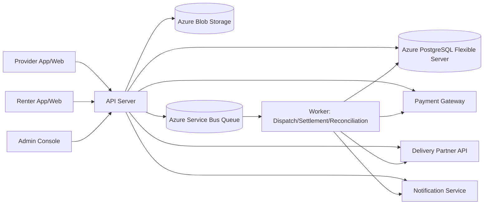

# Luggy MVP Architecture (v0.2)

## 1. 목적
- PRD의 MVP 정책(배송 전용, 왕복 배송, 보증/정산/검수 정책)을 **운영 가능한 시스템**으로 구현한다.
- Web MVP 단계에서는 공헌이익 **계산 로직/계측 가능성**을 보장하고, 실거래 20건 게이트는 2차 운영 검증으로 분리한다.

## 2. 아키텍처 원칙
1. **정책 우선:** 가격/정산/보증/환불 규칙은 하드코딩이 아닌 정책 테이블로 버전 관리.
2. **이벤트 우선:** 예약/배송/검수/정산은 상태 전이 이벤트를 남겨 감사 추적 가능하게 설계.
3. **금전 처리 안전성:** 결제·환불·정산·추가청구는 모두 idempotency key 기반으로 중복 실행 방지.
4. **MVP 단순화:** 단일 지역, 단일 창고, 단일 배송 파트너(또는 어댑터 1개)로 시작.

## 3. 시스템 구성 (MVP)

## 4. 핵심 도메인/모듈
- **Identity & KYC:** 사용자 유형(Provider/Renter/Admin), 결제수단 등록, 약관 동의.
- **Inventory:** 캐리어 등록, 기준가, 감가 정보, 입출고 가능 상태.
- **Booking:** 검색/예약/취소/환불, 최소 대여기간(2일) 검증.
- **Inspection:** 출고 전/반납 후 검수, 사진 증빙, 손상 판정.
- **Delivery:** 왕복 배송 주문, 운송장, 지연/실패 처리.
- **Finance:** 보증금 홀드, 대여 결제, 환불, 정산 분배(80/20), 추가청구, 보증 적립/환입.
- **Dispute:** 파손/분실/미반납 케이스 상태 추적 및 책임 판정.
- **Analytics:** 공헌이익, 전환율, 완료율, 분쟁률 계산.
- **Funnel Experience:** OTA형 검색→결제 퍼널, 추천 정렬, 재고 희소성 노출, 단계별 이벤트 수집.
- **Design System:** 라이트 테마 기반 고대비 CTA(솔리드), 글래스 효과는 보조 컴포넌트에 제한.

## 5. 데이터 저장 설계 (요약)
### 5.1 주요 테이블
1. `users` - role, verified_at
2. `carriers` - owner_user_id, size_type(cabin/medium), brand, model_name, display_image_url, base_price, depreciation_started_at, status
3. `carrier_storage_contracts` - opt_in_rental, guarantee_reserve_rate(15%), active
4. `bookings` - renter_user_id, carrier_id, policy_version_id, start_date, end_date, status
5. `pricing_snapshots` - booking_id, daily_price, min_days, roundtrip_delivery_fee
6. `payments` - booking_id, type(rental/deposit/late_fee/extra_claim/refund), amount, status, idempotency_key
7. `delivery_orders` - ref_type(booking/intake), ref_id, leg(outbound/return), status, tracking_no, delivery_address_snapshot_json, failed_reason, delivered_at
8. `inspections` - booking_id, phase(pre_dispatch/post_return), inspector_user_id, result, damage_level, notes
9. `inspection_photos` - inspection_id, object_url, checksum
10. `damage_claims` - booking_id, claim_amount, decision, payable_by
11. `settlements` - booking_id, gross_amount, platform_share, provider_share, settled_at
12. `ledger_entries` - account, delta, reason, ref_type, ref_id
13. `cost_entries` - booking_id, cost_type(delivery/cleaning/packaging/payment_fee/provision), amount, occurred_at
14. `search_logs` - user_id(nullable), session_id, start_date, end_date, size_type, results_count, created_at
15. `funnel_events` - session_id, user_id(nullable), event_name, step, item_id(nullable), metadata_json, created_at
16. `ranking_snapshots` - session_id, ranking_version, item_id, score, position, created_at
17. `policy_versions` - policy_type(pricing/refund/liability/ranking/settlement/deposit), json_rules, effective_from
18. `event_logs` - aggregate_type, aggregate_id, event_type, payload, occurred_at

### 5.2 필수 제약
- booking 생성 시 `end_date >= start_date + interval '2 day'`
- 활성 예약과 carrier 기간 중복 금지 (exclusion constraint)
- 금전 이벤트(`payments`, `settlements`)는 `idempotency_key` unique
- 사진 없는 검수 완료 금지 (`inspections` 완료 전 `inspection_photos >= 1`)

## 6. 핵심 상태 전이
### 6.1 Booking 상태
`requested -> payment_method_saved -> payment_authorized(D-1) -> confirmed -> outbound_in_transit -> in_use -> return_in_transit -> inspection_pending -> claim_resolving(optional) -> completed`

예외:
- `cancelled` (취소 정책 적용)
- `overdue` (연체 1일당 20,000원)
- `lost` (연체 3일 경과 또는 분실 확정)
- `disputed` (파손/책임 이슈)

### 6.2 Carrier 상태
`intake_pending -> available -> reserved -> rented -> return_processing -> available`

예외:
- `maintenance` (수리/세척)
- `retired` (폐기/미운영)

## 7. 금전 처리 규칙 (PRD 반영)
1. **총결제액 = 대여료 + 왕복배송비**
2. **정산분배:** 총결제액 기준 Platform 80% / Provider 20%
3. **보증금:** 기내용 30,000원 / 중형 50,000원 (사전 승인/홀드)
4. **보증 초과 손해:** 사전 승인 결제수단으로 추가청구, 7일 내 납부
5. **지연 보상:** 당일 미도착 시 배송비 100% 환불
6. **환불 규칙:** 수령 48시간 전 100%, 24시간 전 50%, 이후 0%
7. **보증 적립:** 캐리어 기준가의 15% (ledger 상 reserve_liability 계정으로 적립/사용/환입)
8. **결제 승인 타이밍:** 예약 시 결제수단 저장, 보증금/대여료 승인은 출고 D-1 실행
9. **보증 적립 인출 트리거:** 클레임 확정 후 Renter 청구 실패 또는 회수 부족분 발생 시 reserve_liability에서 보전

## 8. 백엔드 워커/배치
- `dispatch-scheduler`: 출고/반납 배송 주문 생성
- `delivery-reconciler`: 배송 상태 폴링, 지연/실패 이벤트 기록
- `settlement-worker`: 클레임 종료 후 완료 예약 정산 실행(중복 방지)
- `overdue-worker`: 연체료 일일 부과, 3일 경과 시 lost 전환
- `profitability-worker`: 건당 공헌이익 계산 및 대시보드 적재

## 9. API 표면 (요약)
- `POST /providers/carriers` 등록
- `POST /providers/carriers/{id}/opt-in` 렌탈 허용
- `GET /renters/search?sort={recommended|price}` 날짜/사이즈 검색
- `GET /carriers/{id}` 캐리어 상세 조회
- `POST /bookings` 예약 생성
- `GET /bookings/{id}` 예약 상세/배송 상태 조회
- `POST /bookings/{id}/authorize-payment` 결제/보증 승인(D-1)
- `POST /bookings/{id}/cancel` 취소/환불
- `POST /inspections` 검수 기록 + 사진 업로드
- `POST /bookings/{id}/complete` 반납 완료/정산 트리거
- `POST /claims/{id}/resolve` 파손 청구 판정
- `POST /funnel/events` 단계별 퍼널 이벤트 수집
- `POST /webhooks/payments` 결제 파트너 웹훅 수신
- `POST /webhooks/delivery` 배송 파트너 웹훅 수신

## 10. 관측성/감사
- 모든 상태 전이에 `event_logs` 기록
- 결제/환불/정산/추가청구는 ledger 이중기록
- SLA 메트릭:
  - North Star: 첫 예약 결제 완료 수
  - Landing→Search 실행률
  - Search→Detail 진입률
  - Detail→Checkout 진입률
  - Checkout→Paid 완료율
  - 배송 정시율
  - 검색→예약 전환율
  - Provider 렌탈 허용 비율
  - 예약→완료율
  - 파손/분쟁률
  - 건당 공헌이익

## 11. 보안/신뢰
- 사진 원본 해시 저장(증빙 위변조 방지)
- 관리자 판정 액션 RBAC + 감사로그
- 민감 데이터 암호화(결제토큰, 연락처, 주소)
- 웹훅 서명 검증(결제/배송 파트너)

## 12. 출시 전 아키텍처 검증 체크리스트
1. **손익 계산 로직 검증:** 더미 데이터 기준 공헌이익 계산이 자동화되는가
2. **중복결제 방지:** 동일 idempotency key 재시도 시 단일 처리되는가
3. **정산 정확도:** Platform/Provider 분배가 정책대로 재현되는가
4. **지연·분실 처리:** overdue/lost 전이가 자동 동작하는가
5. **분쟁 증빙성:** 검수 사진+판정 로그만으로 책임 추적 가능한가

## 13. 남은 기술 리스크
1. 총결제액 기준 80/20 분배가 Provider 공급을 저해할 가능성
2. 보증 적립 15%의 재무 안정성(적립 시점/해제 시점) 부족 가능성
3. 배송 전용 구조에서 지역 확장 시 물류비 급증 가능성
